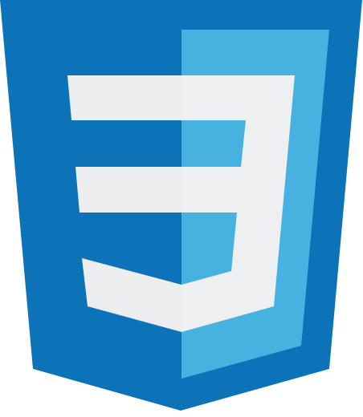
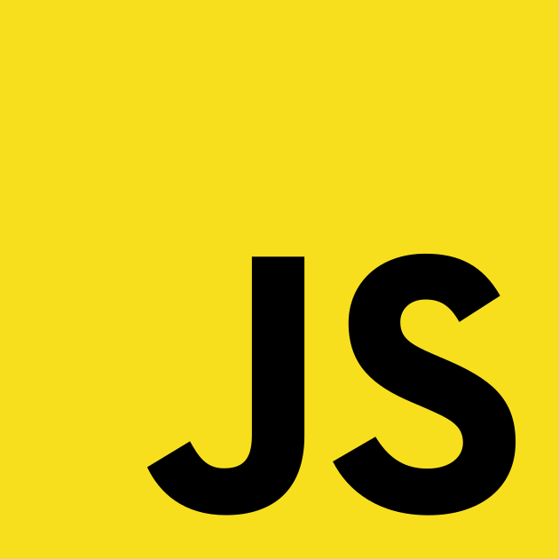
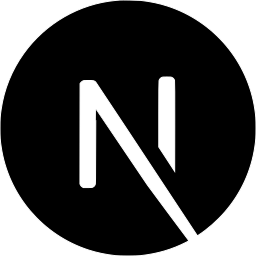

<h3 align="center"> 👋🏻 Hi, I'm Nicolas Zulaica</h3>
<h4 align="center"> Software Engineer (UBA)</h4>

  
  <!--
  &nbsp;&nbsp;
  
  &nbsp;&nbsp;
 
  -->

---
  <!--

  
  &nbsp;
  
  &nbsp;
  
  &nbsp;
  
  &nbsp;
  
  &nbsp;
  
  &nbsp;

  -->
  
  <!-- img src="https://upload.wikimedia.org/wikipedia/commons/thumb/1/1f/WebAssembly_Logo.svg/2048px-WebAssembly_Logo.svg.png" height="28px" alt="wasm" title="web assembly"/-->
  
  
  
  <!--
  &nbsp;&nbsp;
  
-->
  
 

<!--
**NicolasEzequielZulaicaRivera/NicolasEzequielZulaicaRivera** is a ✨ _special_ ✨ repository because its `README.md` (this file) appears on your GitHub profile.

Here are some ideas to get you started:

- 🔭 I’m currently working on ...
- 🌱 I’m currently learning ...
- 👯 I’m looking to collaborate on ...
- 🤔 I’m looking for help with ...
- 💬 Ask me about ...
- 📫 How to reach me: ...
- 😄 Pronouns: ...
- ⚡ Fun fact: ...

## resources
https://worldvectorlogo.com/
https://icons8.com/icons

-->
